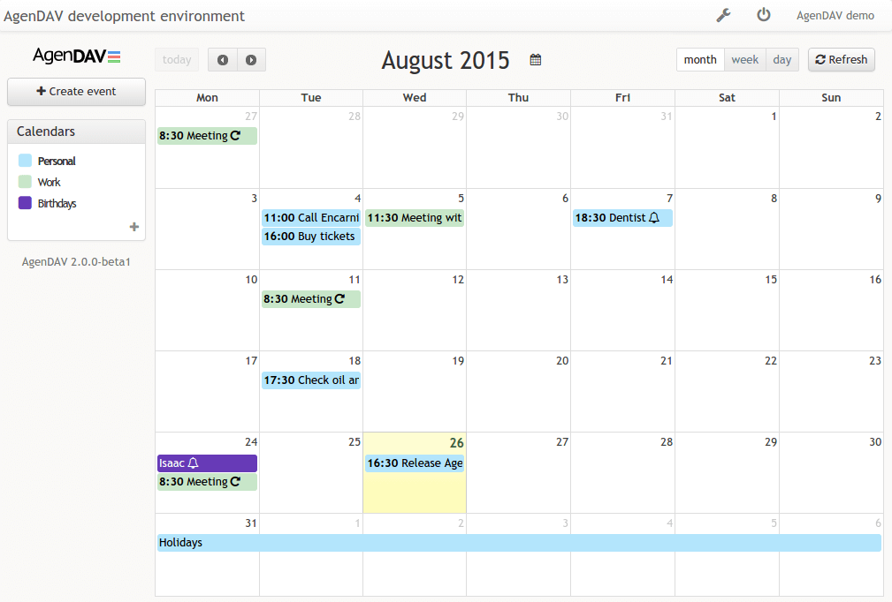

# AgenDAV - CalDAV web client

AgenDAV is a CalDAV web client which features an AJAX interface to allow
users to manage their own calendars and shared ones.

## Requirements

AgenDAV requires:

- A CalDAV server like [Baïkal](http://baikal-server.com/), [DAViCal](http://www.davical.org/), [Radicale](https://radicale.org/tutorial/), etc
- A web server
- PHP >= 5.5.9
- PHP ctype extension
- PHP mbstring extension
- PHP mcrypt extension
- PHP cURL extension
- A database supported by [Doctrine DBAL](https://www.doctrine-project.org/projects/doctrine-dbal/en/2.12/reference/configuration.html#configuration) like MySQL, PostgreSQL, SQLite
- Optional: nodejs & npm to build assets (releases include a build)

## Installation

See [installation guide](https://agendav.readthedocs.io/en/develop/admin/installation/)

## Source

https://github.com/agendav/agendav

## License

GNU GENERAL PUBLIC LICENSE Version 3

## Changelog

See [CHANGELOG.md](./CHANGELOG.md)

## Contribution

[Contributions](./CONTRIBUTING.md) are welcome!
