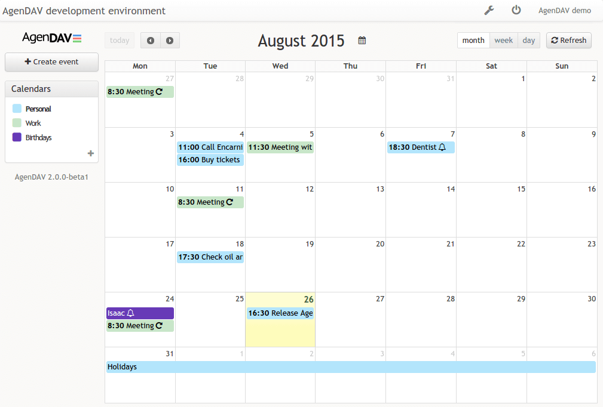

# AgenDAV - CalDAV web client

AgenDAV is a self-hosted, open-source web client to manage your own
and shared calendars.

It speaks the open CalDAV standard, so you can point it at any
compliant server - Baïkal, Nextcloud, DAViCal, Radicale, and others -
and keep using the same calendars from other apps like Thunderbird,
Apple Calendar, and DAVx5. AgenDAV itself just displays the events and
sends your changes back to the CalDAV server.

## Features

- Calendar views - Month, Week, Day, and List
- Event management - create, edit, duplicate, and delete events
- Drag and drop - move events to a new time slot or day, resize to adjust duration
- Recurring events - create and edit repeating events with recurrence rules
- Reminders - per-event reminders with a configurable default for new events
- Calendar delegations - access calendars delegated by other users (read or read/write)
- iCal subscriptions - subscribe to external iCal feeds
- User preferences - each user may set language, timezone, week start, hide weekends and working hours
- Auto-refresh - calendar data refreshes automatically every 5 minutes
- Multi-language - localized UI with fallback to English
- Multiple CalDAV backends - works with Baikal, DAViCal, Radicale, Nextcloud, and others
- Interoperable - the same calendars stay usable from other CalDAV apps
  like Thunderbird or DAVx5
- Multiple database backends - MySQL, PostgreSQL, SQLite

## Requirements

AgenDAV requires:

- A web server
- PHP >= 8.5.0
- PHP mbstring extension
- PHP openssl extension
- PHP cURL extension
- A database supported by Doctrine-DBAL like MySQL, PostgreSQL, SQLite
- A CalDAV server like [Baïkal](https://github.com/sabre-io/Baikal),
  [DAViCal](https://www.davical.org/),
  or [Radicale](https://radicale.org/)
- Optional: nodejs & npm to build assets (releases include a build)

## Documentation

https://agendav.readthedocs.io/

## Installation

See [installation guide](https://agendav.readthedocs.io/en/latest/admin/index.html)

### Docker Image

Agendav offers no official Docker image.

A `docker-compose.yml` is provided in this repository for _local
development_ though. Run `docker compose up` from the repository root
to bring up AgenDAV (PHP-Apache, on port 8080), MariaDB,
and a Baikal CalDAV server (on port 8081).

The asset build the first time the stack starts. Run
`bash docker/reset-events.sh` to reset the docker calendars with
example events.

## Source

https://github.com/agendav/agendav

## License

GNU General Public License v3.0 or later
https://spdx.org/licenses/GPL-3.0-or-later.html

## Changelog

See [CHANGELOG.md](./CHANGELOG.md)

## Maintenance Mode

AgenDAV is in maintenance mode currently. This means that the maintainers
choose to prioritize stability and compatibility over new features for now.

- There is no active development & new major features are not planned
- New features may be added by PRs however
  - New features may be proposed in issues tickets, send as Pull Requests,
    and the maintainers will review and presumably merge them
- *PRs for bugfixes are welcome* and will be reviewed & merged
- PRs to keep the software compatible with new PHP versions or the like
  are welcome and will be reviewed & merged
- Critical security concerns will be addressed

## Contribution

[Contributions](./CONTRIBUTING.md) are welcome!
